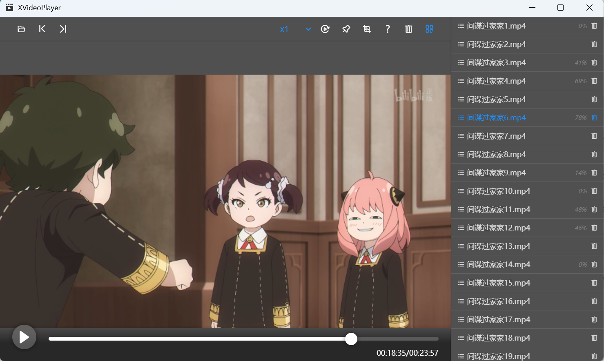

# XVideoPlayer本地视频播放器

- [x] ffmpeg视频解码
- [x] 视频流播放,视频分片播放
- [x] 倍速
- [x] 拖拽进度
- [x] 下一集，上一集
- [x] 不同视频格式解析转换播放
- [x] 置顶
- [x] 截图
- [x] 菜单显隐，文件列表，清空视频，历史进度
- [x] 自动播放
- [x] 左右箭头-快进后退
- [x] 空格-暂停或播放

## 待解决问题

1. 视频截取视频进度时间越到后面，截取花费的时间越长
